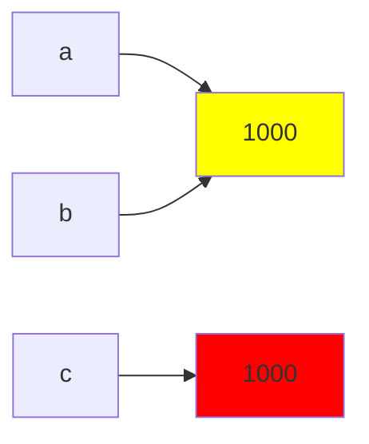

# Задание 1
## 1 
  ### В REPL результат любого выражения показывается автоматически, а при запуске файла в терминале не отображается результат вычислений, так как в файле не содержалось команды отобразить результат 
   ####  
    
### Для того, чтобы при запуске файла результат отобразился в терминале нужно добавить функцию print 
  #### 

## 2
  ### 
   #### Выражениями являются фрагменты 4 * 2, "Python" и f"{course}: {hours} часов"
   #### Инструкциями являются все строки кода
   #### Литералы: "Python", 4, 2, f"{course}: {hours} часов"
   #### Создающиеся имена: course и hours

## 3
  ### Версия интерпретатора: Python 3.12.3
   #### 

  ### Узел присваивания: Assign
  ### Узел арифметической операции: BinOp
   #### 
  ### Узел вызова print(): Call
   #### 

  ### Инструкция, отвечающая за загрузку константы: LOAD_CONST
  ### Инструкция, отвечающая за вызов функции: CALL
   #### 

  ### Байткод CPython нельзя считать машинным кодом процессора потому что байткод выполняется не процессором напрямую, а виртуальной машиной python.

# Задание 2
  ### Прогнозы сравнений:
   #### 1) True 
   #### 2) True
   #### 3) True
   #### 4) False
   
  ## 1.

  ## 2. 
   ### При проверке на равенство элементов сравнивается их значение, а при проверке на идентичность проверяется, ссылаются имена на один объект в памяти или на разные
  ## 3. 
   ### 
  ## 4. 
   ### В python одинаковые строковые литералы хранятся в памяти в единственном экземпляре, операция конкатенации строк выполняется на этапе компиляции
   #### 
  ## 5. 
   ### == нужно использовать для сравнения значений, а is для проверки на идентичность
  ## Контрольные вопросы:
   ### 1) Инструкция b = a не создаёт копию объекта, а создаёт новое имя b, которое ссылается на ту же ячейку в памяти, что и a
   ### 2) type() возвращает тип объекта, имя которого указано в скобках, id() возвращает число, представляющее адрес объекта в памяти
   ### 3) None принято сравнивать с помощью is, так как все переменные None ссылаются на один и тот же объект
# Задание 3
 ## Эксперимент A
  ### / и // возвращают разные значения и результаты разных типов потому что операция // - это операция деления нацело, поэтому при её выполнении в результате не может получиться нецелое число
   #### 

 ## Эксперимент B
  ### Целые числа в python отличаются способом хранения: большое число хранится не как одна переменная, а как массив частей числа, что позволяет хранить числа любого размера
   #### 
 ## Эксперимент C
  ### Числа с плавающей точкой хранятся в двоичной системе счисления, поэтому не могут быть вычислены точно, из-за этого и наблюдаются приведённые ниже результаты. Например число 0.1 в двоичной системе счисления представлено как 0.000110011001100... и округляется до десятичного 0.10000000000000000555... что не равно 0.1
  #### 
  ### Для безопасного сравнения чисел типа float следует использовать функцию isclose() 
 ## Эксперимент D
  ### bool("False") даёт истинное значения, потому что любая непустая строка в python является истинной
   #### 
 ## Контрольные вопросы:
  ### 1) При использовании операции / всегда возвращается тип float, потому что результат может оказаться нецелым
  ### 2) Отличие преобразования int("42") от int(42.9) в том, что это операции перевода разных типов в тип int, int("42") переводит строку в тип int, при условии что в строке записано корректное целое число, а int(42.9) переводит число типа float в число типа int путём отбрасывания дробной части числа.
  ### 3) falsy являются значения bool(0) и bool("")
# Задание 4
 ## 1-6
  ### 
 ## 7
  ### 
 ## 8
  ### Причина ошибки: тип str является неизменяемым типом данных.
   #### 
 ## Контрольные вопросы: 
  ### 1) len(symbol) выводит количество символов в строке, а len(symbol.encode("utf-8")) выводит количество байт для хранения строки
  ### 2) start - индекс начала среза включительно, stop - индекс конца среза не включительно, step - с каким шагом берутся символы для среза
  ### 3) Методы вроде .upper() не меняют исходную строку, а создают новую
# Задание 5
 ## 

