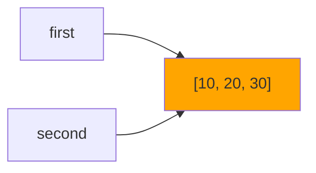
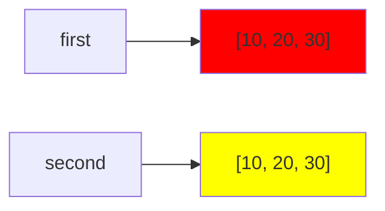

# Цель работы
Исследовать связь между именами и объектами, понять различия между присваиванием, поверхностным и глубоким копированием, а также познакомиться с механизмами управления памятью в CPython.

# Задание 1
  ## Эксперимент A
   ### Ожидаемый резултат: после выполнения инструкции a += 1 будет создан новый объект, поэтому id(a) поменяется
   ### Значение, связанное с именем b не изменилось, потому что при выполнении инструкции a += 1 в памяти был создан новый объект, так как int является неизменяемым типом
   #### 
  ## Эксперимент B
   ### Ожидаемый результат: после выполнения инструкции second.append(30) список first так же изменится
   #### 
   ### Дополнения
   #### 
   ### Схема связей между именами и объектами до переназначения

   ### Схема связей между именами и объектами после переназначения

